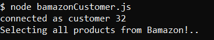
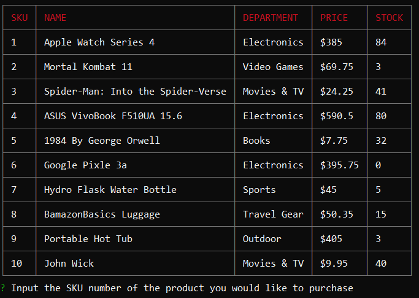
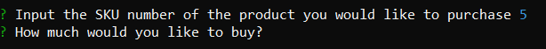
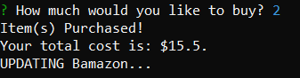
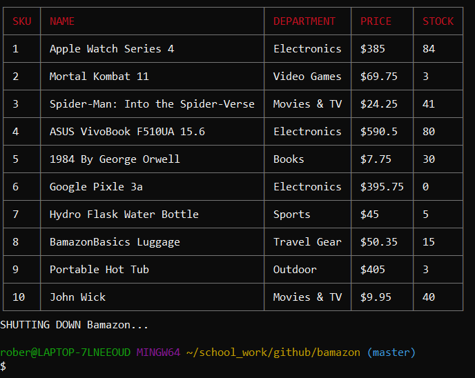

# bamazon

Bamazon is an Amazon-like storefront using node and sql. It is displayed all in the command line.

## Bamazon uses: 

* [mysql](https://www.npmjs.com/package/mysql) 
    * Used to connect node with the sql database.

* [inquirer](https://www.npmjs.com/package/inquirer)
    * Used to cleanly display an interactive user in the command line.

* [cli-table](https://www.npmjs.com/package/cli-table)
    * Used to render tables cleanly on the command line.

## Bamazon in use

To start Bamazon type '**node bamazonCustomer.js**' into the command line.

2 logs will appear.

* One will say that you're connected as customer ## which indicates that the connection with sql and node was successful.

* Following that it will log 'Selecting all products from Bamazon!...'

Then the table using [cli-table](https://www.npmjs.com/package/cli-table) will display showing 10 products. Each product has 10 descriptors, the sku number, product name, department name, price and the stock quantity.

Following this the first qustion will appearing asking you to provide the sku number of a product to select it. From 1 to 10.

For this example we'll select SKU number **5**, which is **1984 By George Orwell**.

**Notice that there is 32 copies left in the STOCK for the product 5**

After enterting the SKU number of the product you would like to buy press enter and it will save your response and display the next question.

We'll buy two copies of product 5. Following this many actions will occur.

3 logs will appear

* The first display 'Item(s) Purchased!'

* Then it will display your total cost which is the price of the product mutliplied by the amount purchased.

* Afterwards it will display 'UPDATING Bamazon...'

After the logs an upated table will display and a final log 'SHUTTING DOWN Bamazon' which indicates that it will end the connection.

Notice how the STOCK number for product 5 went down from 32 to 30. This updates the database itself.

